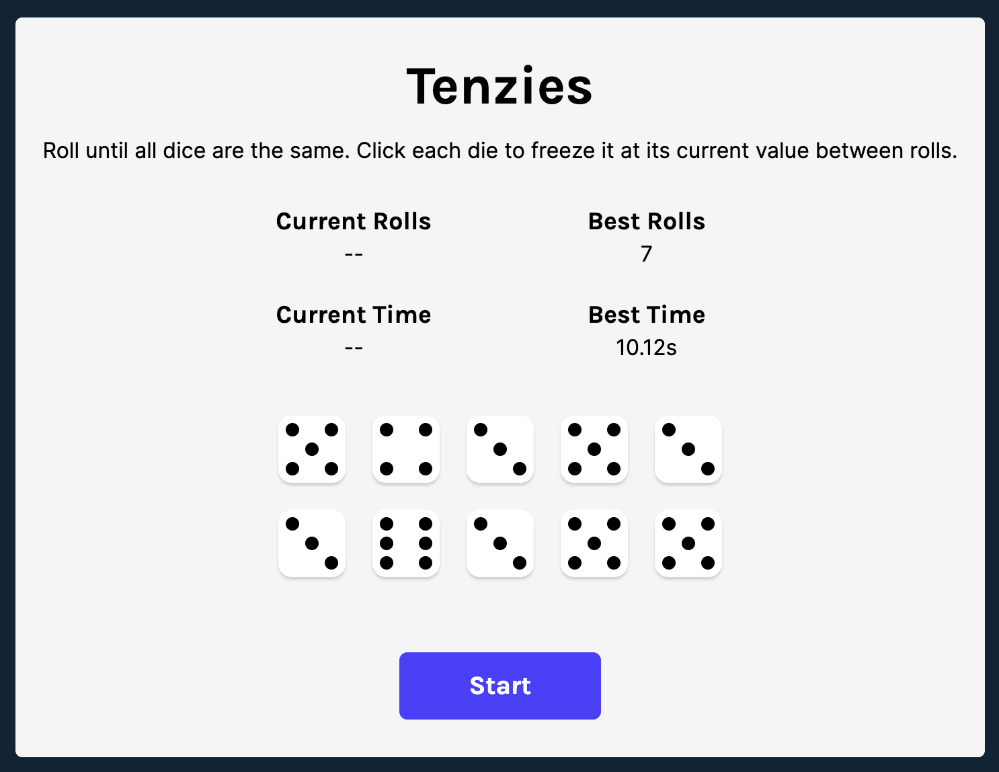

# React-Tenzies

## Description

This is the capstone project of the of the [React course by Bob Ziroll on Scrimba](https://scrimba.com/learn/learnreact). I added a few [features](#features) on top of the original project.
The objective of the game is to roll the dice until all of them show the same value. You can click on individual dice to hold them at their current value while rolling the rest. The game keeps track of the number of rolls and the time taken to achieve Tenzies.

## Live Demo

You can try the game [here](https://tiffanychan614.github.io/React-Tenzies/).

## Built with

- HTML 5
- CSS 3
- JavaScript
- React JS

## Extra features

- Track the number of rolls
- Track the time taken to achieve Tenzies
- Save the best time and number of rolls in local storage
- Display 'New Best!' message when you beat your previous best
- Time won't start and dice will be disabled until you make your first roll
- New set of dice will be rolled whenever you press 'Start' to ensure fairness (different from the initial set shown when you first load the application)

## Screenshots

## Usage

1. When you first load the application, you will see the title "Tenzies" and a set of dice on the screen.
2. The objective of the game is to roll the dice until all of them show the same value.
3. To roll the dice, click the "Roll" button.
4. After each roll, the dice will show new values, and you can choose to hold some dice by clicking on them. The held dice will not change their value in the subsequent rolls.
5. Continue rolling the dice and holding them until all dice show the same value. Once achieved, confetti will appear on the screen.
6. The game keeps track of your statistics, including the number of rolls and the time taken to achieve Tenzies.
7. If you want to start a new game, click the "New Game" button.
8. The game also keeps track of your best statistics, which are displayed on the screen. The best record is determined first by the number of rolls, followed by the time taken to achieve it (the best record won't update even if you beat your previous time but fail to beat your best number of rolls). If you beat your previous best, a "New Best!" message will appear.

## Skills Learned

- Event handling in React
- Conditional rendering in React
- Using local storage to save data
- Handling state and side effects in React
- Using `setInterval()` and `clearInterval()` to create a timer

## Future Improvements

- --Replace the number on the dice with dots--
- --Add inset shadow to the dice when they are being clicked--
